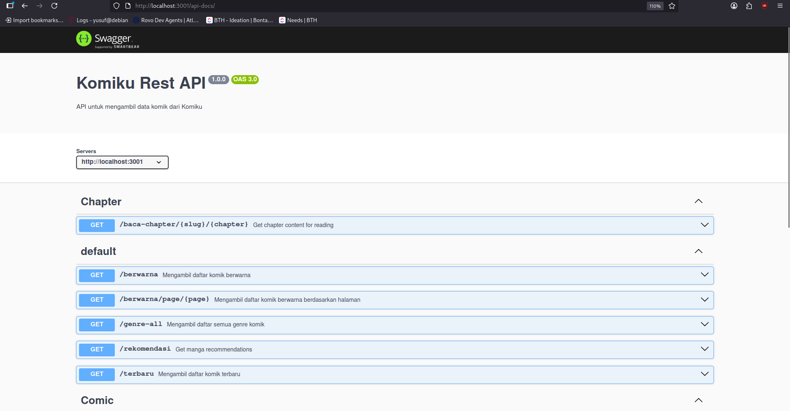

<!-- GitAds-Verify: WBSRH26RS33MFZHKP3H9ZYH6UFSEW5LS -->

  

  <h3 align="center">Mangaverse-API</h3>

<!--  -->
  

    <samp>A RESTful API for scraping and serving manga/manhwa/manhua data from <a href="http://komiku.id/">Komiku.id.</a></samp>
     
    <a href="https://github.com/vernsg/komiku-rest-api"><strong>Explore the api »</strong></a>
     
  

